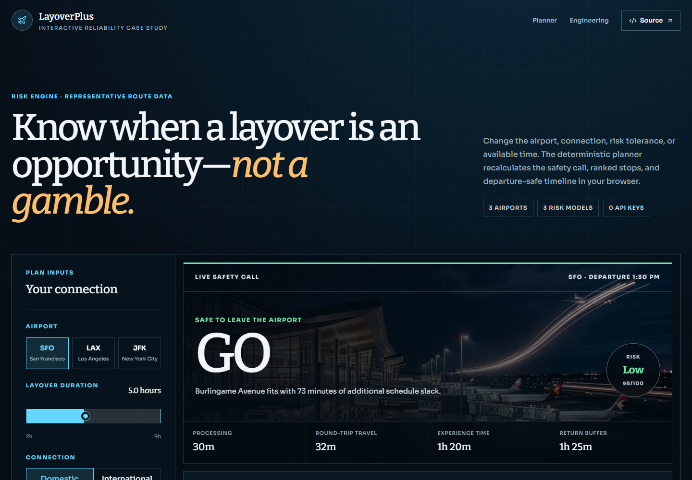
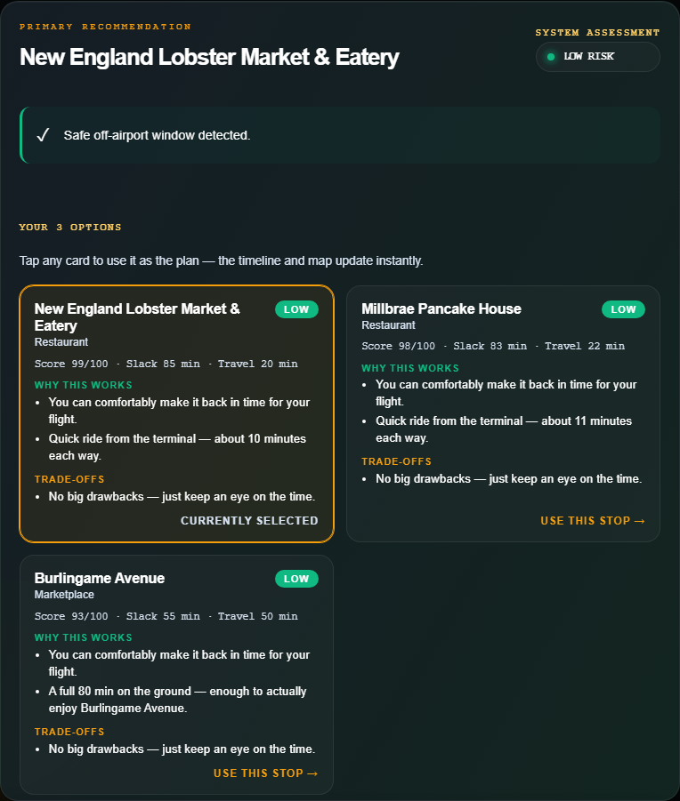
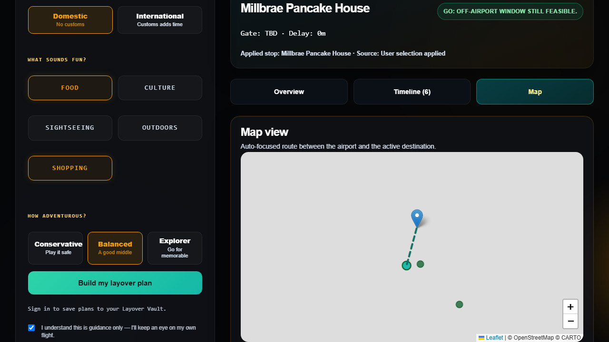

# LayoverPlus

[](https://github.com/calebponce/Layover-Plus/actions/workflows/reliability-ci.yml)
[](https://github.com/calebponce/Layover-Plus/actions/workflows/portfolio-demo.yml)

Risk-aware micro-itineraries for airport layovers, built with React, Express, Gemini, OpenStreetMap, and Playwright.

LayoverPlus answers a deceptively difficult travel question: **is there enough time to leave the airport, enjoy one nearby stop, and return without gambling on the next flight?** It turns flight timing, airport-specific buffers, traveler risk tolerance, routing estimates, and nearby places into a timestamped plan with an explainable go/no-go recommendation.

> **[Try the live portfolio demo](https://calebponce.github.io/Layover-Plus/)** — no account, API key, or paid service required. The demo uses representative route data and runs the deterministic safety engine entirely in the browser.

> Portfolio status: functional full-stack prototype with deterministic safety logic, graceful third-party fallbacks, contract tests, browser-level interaction coverage, an interactive recruiter demo, and automated CI. It is not production flight-operations guidance.

## Live portfolio demo

The GitHub Pages experience is a focused, zero-cost version of the product built for quick evaluation. Change the airport, layover duration, connection type, risk tolerance, or ranked destination and the safety call, score, and timestamped itinerary update together.

- A hard feasibility rule prevents a destination from receiving a `GO` result when its required time exceeds the layover.
- Every recommendation exposes its processing, travel, experience, and protected-return assumptions.
- A two-hour layover demonstrates the explicit `STAY AIRSIDE` failure state instead of forcing a recommendation.
- The Pages build isolates the recruiter demo from the full React/Express application, so it ships only the zero-key interactive case study; authentication, provider integrations, and the saved-plan experience remain available in this repository.



## Full application preview

| Ranked, explainable destinations                                                         | Synchronized selected route                                                  |
| ---------------------------------------------------------------------------------------- | ---------------------------------------------------------------------------- |
|  |  |

## Why this project stands out

- **Safety logic stays deterministic.** Gemini can rank feasible candidates and improve wording, but it cannot override processing time, return buffers, feasibility math, or risk labels. Fast boundary tests prove that an exact-fit itinerary is accepted, a one-minute overrun is rejected, and risk labels change only as protected slack increases. Mocked-provider tests cover infeasible picks, malformed responses, and unsupported numeric or categorical safety claims; generated prose is not a substitute for verifying real-world conditions.
- **The product degrades gracefully.** If Gemini is unavailable, the API returns deterministic narrative guidance. If live POI or route services fail, curated destinations and conservative distance estimates keep the planning flow usable.
- **Choices remain synchronized.** Selecting another destination replans the recommendation, timeline, and map as one state transition; Playwright verifies that behavior end to end.
- **The API exposes its reasoning.** Responses include score components, effective buffers, selection source, AI metadata, latency, and map-service runtime counters.
- **The service includes practical guardrails.** Zod validation, Helmet, rate limiting, JWT authentication, password hashing, bounded in-memory stores, retries, and caches cover the prototype's main failure modes.

## Product flow

1. Enter the airport and layover window.
2. Select connection type, interests, and risk tolerance.
3. Review three ranked destinations and the timing tradeoffs for each.
4. Apply a destination to update the recommendation, timestamped itinerary, and route map.
5. Optionally use Gemini and place-provider keys for richer ranking, language, photos, ratings, and reviews.

Supported airports: `SFO`, `LAX`, and `JFK`.

## Architecture

| Layer                         | Responsibility                                                                                                           |
| ----------------------------- | ------------------------------------------------------------------------------------------------------------------------ |
| React + Vite PWA              | Planner form, candidate comparison, itinerary timeline, map, auth views, and saved-plan experience                       |
| Express API                   | Validation, auth, planning orchestration, telemetry, feedback, and place-preview proxying                                |
| Deterministic planning engine | Airport processing assumptions, return buffers, travel limits, dwell time, feasibility, scoring, and risk classification |
| Gemini                        | Optional feasible-candidate ranking, constrained itinerary wording, and traveler tips; prose still requires judgment     |
| Overpass + OSRM               | Live nearby-place discovery and route estimates, protected by retry, cache, and fallback behavior                        |
| Playwright                    | API contracts plus the browser-level destination choice synchronization test                                             |

The backend computes a structured feasibility result first. AI receives constrained context and may explain or rank feasible stops, but its output is not permitted to change the schedule or timing values. The numeric and safety-phrase checks are bounded safeguards, not a guarantee that every sentence is factually correct or that real-world travel is safe.

## Tech stack

- React 19, React Router, Vite, Framer Motion, Leaflet, and PWA support
- Node.js 20.19+ and Express
- Gemini Generative Language API
- OpenStreetMap Overpass and OSRM
- Zod, Helmet, express-rate-limit, JWT, bcrypt, and Pino
- Playwright contract and end-to-end tests
- GitHub Actions CI

## Run locally

Requirements: Node.js 20.19 or newer.

```bash
git clone https://github.com/calebponce/Layover-Plus.git
cd Layover-Plus
npm ci
```

For local development, run the API and frontend in separate terminals:

```bash
npm run dev:server
```

```bash
npm run dev:client
```

Open `http://localhost:5173`. For a production-style local run:

```bash
npm run build
npm start
```

The application works without paid API credentials. To enable optional integrations, copy `.env.example` to `.env` and add the keys you want:

```dotenv
GEMINI_API_KEY=your_key
GEMINI_MODEL=gemini-2.0-flash
GOOGLE_PLACES_API_KEY=your_optional_key
YELP_API_KEY=your_optional_key
```

## Test and verify

```bash
npm run build
npm run test:safety
npm run test:contract
npm run test:e2e
npm audit --omit=dev
```

CI runs clean installs, deterministic safety-boundary tests, a production build, the production dependency audit, API contract tests, and the end-to-end choice synchronization scenario. Browser tests force the curated POI mode so their result does not depend on live third-party availability. A separate GitHub Pages workflow verifies and deploys the portfolio demo from `main`.

## API surface

| Endpoint                  | Purpose                                                   |
| ------------------------- | --------------------------------------------------------- |
| `GET /api/health`         | Health and API metadata                                   |
| `GET /api/config`         | Supported airports, interests, and options                |
| `POST /api/plan`          | Generate or replan a risk-aware itinerary                 |
| `POST /api/flight-status` | Simulate gate, delay, and replan signals                  |
| `GET /api/place-preview`  | Fetch normalized place details and provider links         |
| `GET /api/place-photo`    | Proxy Google Place photos without exposing the server key |
| `POST /api/feedback`      | Record a plan rating and comment                          |
| `POST /api/event`         | Accept best-effort product telemetry                      |
| `GET /api/usage`          | Return request and planning performance counters          |
| `GET /api/replan-history` | Return recent replan events for a session                 |

See [the API structure](docs/api-structure.md) for request, response, and error examples.

## Ownership and attribution

LayoverPlus began as a three-person San Francisco State University project. The original ownership areas were:

| Contributor                                  | Primary area            |
| -------------------------------------------- | ----------------------- |
| [Caleb Ponce](https://github.com/calebponce) | AI and backend          |
| Edson Sanchez Bernal                         | Frontend and UX         |
| Omshree Rajanikant Bharodiya                 | Data and planning logic |

The repository preserves the full team history and names instead of presenting collaborative work as a solo project. Cross-cutting integration was collaborative.

## Current limitations

- Airport timing assumptions are configurable estimates, not live operational guarantees.
- Flight status is simulated; a production version should integrate an authoritative provider.
- In-memory auth, telemetry, and saved data are prototype storage and reset on restart.
- Only three airports have curated configuration today.
- Live provider quality and quotas vary, so fallbacks intentionally favor continuity over freshness.

## License

Released under the [MIT License](LICENSE).
